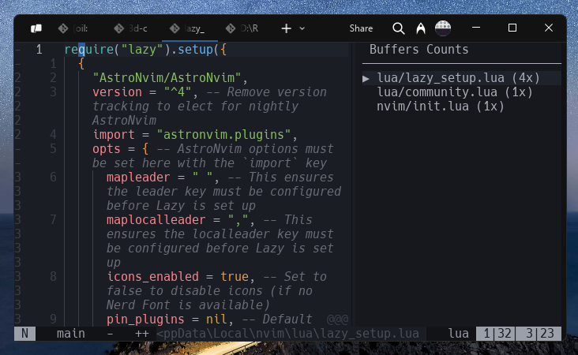

# buffcounts.nvim



this plugin aims to improve clarity for each opened buffer, providing a clear ranking for the most opened buffers.

- enhance workflow clarity
- easy to re-open buffer with tools like `telescope.nvim`
- respect long directory path or filename (one level parent dir)
- respect main content width view (not hiding the actual viewed content below)

## installation

### `lazy.nvim`

```lua

return {
  -- ...
  {
    "naranyala/buffcounts.nvim",
    config = function()
      require("buffcounts").setup {
        min_width = 25,
        max_width = 80,
      }

      -- reset every open project and show the sidebar/panel
      vim.cmd [[BuffCountsReset]]
      vim.cmd [[BuffCountsToggle]]
    end
  }
  -- ...
}

```

there is three main command:

- BuffCountsToggle: toggle show/hide sidebar or panel
- BuffCountsRefresh: reload the ui
- BuffCountsReset: reset the rank

## todos

- [] disable sorting, just list of buffer history
- [] navigate buffer history with index

> 2025 - @naranyala
