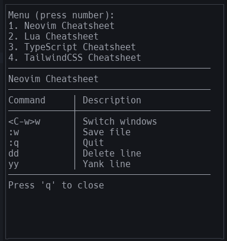

# easyref.nvim

easy reference for your own dictionaries a.k.a cheatsheets inside fixed-panel-view cross-projects-accessible



## instalation

### `lazy.nvim`

```lua
return {
  --- ...
  {
    "naranyala/easyref.nvim",
    config = function()
        require("easyref").setup({})
      vim.cmd [[EasyRef]]
    end
  }
  --- ...
}
```

## todos

## enjoy
